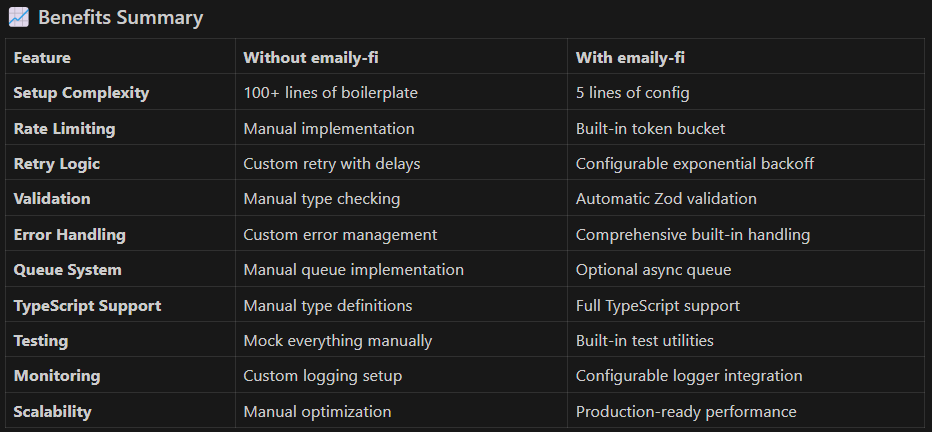

# emaily-fi

A powerful, production-ready TypeScript package for sending email notifications with enterprise-grade features including Gmail SMTP, rate limiting, retry mechanisms, queue system, and extensible provider architecture.

[](https://badge.fury.io/js/emaily-fi)
[](https://opensource.org/licenses/MIT)
[](https://www.typescriptlang.org/)

## 🌟 Why emaily-fi?

**emaily-fi** is designed for developers who need a reliable, scalable email solution without the complexity. Whether you're building a startup MVP or an enterprise application, this package provides the tools you need for professional email delivery.

### ✨ Key Benefits

- **🚀 Production Ready** - Battle-tested with comprehensive error handling and retry logic
- **⚡ High Performance** - Async queue system for handling thousands of emails
- **🛡️ Enterprise Grade** - Rate limiting, retry mechanisms, and security best practices
- **🔧 Developer Friendly** - Full TypeScript support, intuitive API, and extensive documentation
- **📈 Scalable** - From single emails to bulk campaigns with filtering and targeting
- **🎯 Flexible** - Multiple send modes for different use cases



## 🚀 Features

### Core Features

- ✅ **Multiple Send Modes**: Send to all, single user, random subset, or filtered users
- ✅ **Gmail SMTP Support**: Easy setup with Gmail App Passwords
- ✅ **Smart Rate Limiting**: Per-second, per-minute, and per-hour controls
- ✅ **Retry Mechanisms**: Automatic retries with exponential backoff
- ✅ **Queue System**: Optional async queue for high-volume dispatches
- ✅ **TypeScript First**: Complete type safety and IntelliSense support

### Advanced Features

- ✅ **Rich Messages**: HTML, CC/BCC, attachments, and custom headers
- ✅ **Input Validation**: Zod-powered validation for reliability
- ✅ **Environment Config**: Secure configuration via environment variables
- ✅ **Custom Logging**: Pluggable logging for monitoring and debugging
- ✅ **Extensible Architecture**: Provider pattern for future email services
- ✅ **Legacy Support**: Backward compatibility with existing configurations

## 📦 Installation

```bash
npm install emaily-fi
```

```bash
# With Yarn
yarn add emaily-fi

# With pnpm
pnpm add emaily-fi
```

## 🚀 Quick Start

### 1. Basic Setup

```typescript
import { EmailNotifier } from "emaily-fi";

const notifier = new EmailNotifier({
  emailUser: "your-email@gmail.com",
  emailPass: "your-app-password", // Gmail App Password
  rateLimit: { maxPerSecond: 1 },
});

await notifier.initialize();
```

### 2. Send Your First Email

```typescript
// Single user
const user = { name: "Alice", email: "alice@example.com" };
const message = {
  subject: "Welcome to our service!",
  body: "Thank you for joining us.",
  html: "<h1>Welcome!</h1><p>Thank you for joining us.</p>",
};

const result = await notifier.sendToOne(user, message);
console.log(result.success ? "✅ Email sent!" : `❌ Failed: ${result.error}`);
```

### 3. Bulk Email Sending

```typescript
const users = [
  { name: "Alice", email: "alice@example.com" },
  { name: "Bob", email: "bob@example.com" },
  { name: "Charlie", email: "charlie@example.com" },
];

// Send to all users
const bulkResult = await notifier.sendToAll(users, message);
console.log(
  `✅ Sent: ${bulkResult.totalSent}, ❌ Failed: ${bulkResult.totalFailed}`
);

// Send to random subset (A/B testing)
const testResult = await notifier.sendRandom(users, message, 2);

// Send to filtered users (targeting)
const premiumResult = await notifier.sendFiltered(
  users,
  message,
  (user) => user.isPremium === true
);
```

### 4. Environment-Based Configuration

```typescript
// .env file
EMAIL_USER=your-email@gmail.com
EMAIL_PASS=your-app-password
MAX_EMAILS_PER_SECOND=2
MAX_EMAILS_PER_MINUTE=100
ENABLE_QUEUE=true

// Your code
import { EmailNotifier, createValidatedConfigFromEnv } from "emaily-fi";

const notifier = new EmailNotifier(createValidatedConfigFromEnv());
await notifier.initialize();
```

## 📋 Real-World Examples

### Newsletter System

```typescript
class NewsletterService {
  private notifier: EmailNotifier;

  constructor() {
    this.notifier = new EmailNotifier({
      emailUser: process.env.EMAIL_USER!,
      emailPass: process.env.EMAIL_PASS!,
      enableQueue: true,
      rateLimit: { maxPerSecond: 1, maxPerMinute: 50 },
      logger: (msg, level) => console.log(`[${level}] ${msg}`),
    });
  }

  async sendWeeklyNewsletter(subscribers: User[], content: string) {
    return await this.notifier.sendToAll(subscribers, {
      subject: "Weekly Newsletter",
      body: content,
      html: `<div style="font-family: Arial;">${content}</div>`,
    });
  }

  async sendTargetedCampaign(subscribers: User[], campaign: Campaign) {
    // Send only to premium users
    return await this.notifier.sendFiltered(
      subscribers,
      campaign.message,
      (user) => user.subscription === "premium"
    );
  }
}
```

### Order Notifications

```typescript
class OrderService {
  private notifier: EmailNotifier;

  async sendOrderConfirmation(customer: User, order: Order) {
    const invoice = await this.generateInvoice(order);

    return await this.notifier.sendToOne(customer, {
      subject: `Order Confirmation #${order.id}`,
      body: `Your order #${order.id} has been confirmed.`,
      html: this.getOrderEmailTemplate(order),
      attachments: [
        {
          filename: `invoice-${order.id}.pdf`,
          content: invoice,
          contentType: "application/pdf",
        },
      ],
    });
  }
}
```

### Express.js Integration

```typescript
import express from "express";
import { EmailNotifier } from "emaily-fi";

const app = express();
const notifier = new EmailNotifier(/* config */);

app.post("/api/send-notification", async (req, res) => {
  try {
    const { users, message } = req.body;
    const result = await notifier.sendToAll(users, message);

    res.json({
      success: true,
      sent: result.totalSent,
      failed: result.totalFailed,
    });
  } catch (error) {
    res.status(500).json({ error: error.message });
  }
});
```

## ⚙️ Configuration

### Complete Configuration Options

```typescript
const notifier = new EmailNotifier({
  // SMTP Settings (Required)
  emailUser: "your-email@gmail.com",
  emailPass: "your-app-password",

  // Optional SMTP Settings
  emailFrom: "Your Company <your-email@gmail.com>",
  smtpHost: "smtp.gmail.com",
  smtpPort: 587,
  smtpSecure: false,

  // Rate Limiting
  rateLimit: {
    maxPerSecond: 1, // Max emails per second
    maxPerMinute: 50, // Max emails per minute
    maxPerHour: 500, // Max emails per hour
  },

  // Reliability & Retry
  retryOptions: {
    maxRetries: 3, // Number of retry attempts
    retryDelay: 1000, // Initial delay between retries (ms)
  },

  // Performance
  enableQueue: true, // Use async queue for bulk sends

  // Monitoring & Debugging
  logger: (message, level) => {
    console.log(`[${level.toUpperCase()}] ${message}`);
  },
});
```

### Environment Variables

```bash
# Required
EMAIL_USER=your-email@gmail.com
EMAIL_PASS=your-app-password

# Optional
EMAIL_FROM="Your Company <your-email@gmail.com>"
SMTP_HOST=smtp.gmail.com
SMTP_PORT=587
SMTP_SECURE=false
MAX_EMAILS_PER_SECOND=1
MAX_EMAILS_PER_MINUTE=50
MAX_EMAILS_PER_HOUR=500
MAX_RETRIES=3
RETRY_DELAY=1000
ENABLE_QUEUE=true
```

## 🛡️ Production Features

### Security & Best Practices

- **Environment Configuration** - Keep credentials secure
- **Input Validation** - Zod-powered validation prevents errors
- **Gmail App Passwords** - Secure authentication method
- **No Credential Storage** - Credentials never stored in code

### Reliability & Performance

- **Automatic Retries** - Exponential backoff for failed sends
- **Rate Limiting** - Prevent provider blocks and ensure delivery
- **Queue System** - Handle high-volume sending efficiently
- **Comprehensive Error Handling** - Detailed error reporting

### Monitoring & Debugging

- **Custom Logging** - Integrate with your logging system
- **Send Metrics** - Track success/failure rates
- **Queue Statistics** - Monitor processing status
- **Debug Mode** - Detailed logging for troubleshooting

## 📊 API Overview

### Send Methods

| Method                                 | Description            | Use Case                          |
| -------------------------------------- | ---------------------- | --------------------------------- |
| `sendToOne(user, message)`             | Send to single user    | User notifications, confirmations |
| `sendToAll(users, message)`            | Send to all users      | Newsletters, announcements        |
| `sendRandom(users, message, count)`    | Send to random subset  | A/B testing, sampling             |
| `sendFiltered(users, message, filter)` | Send to filtered users | Targeted campaigns, segmentation  |

### Queue Management

```typescript
// Monitor queue
const stats = notifier.getQueueStats();
console.log(`Queue: ${stats?.size} pending, ${stats?.pending} processing`);

// Control queue
notifier.pauseQueue(); // Pause processing
notifier.resumeQueue(); // Resume processing
```

### Error Handling

```typescript
const result = await notifier.sendToAll(users, message);

// Check overall success
console.log(`Success rate: ${result.totalSent}/${users.length}`);

// Handle individual failures
result.results.forEach((r) => {
  if (!r.success) {
    console.error(`Failed to send to ${r.recipient}: ${r.error}`);
  }
});
```

## 🧪 Testing

### Mock for Development

```typescript
// Use environment variable to switch between real and mock
const notifier =
  process.env.NODE_ENV === "test"
    ? new MockEmailNotifier() // Your mock implementation
    : new EmailNotifier(config);
```

### Unit Testing with Jest

```typescript
import { EmailNotifier } from "emaily-fi";

describe("EmailNotifier", () => {
  let notifier: EmailNotifier;

  beforeEach(() => {
    notifier = new EmailNotifier({
      emailUser: "test@example.com",
      emailPass: "test-password",
      logger: jest.fn(), // Mock logger
    });
  });

  it("should send email successfully", async () => {
    const result = await notifier.sendToOne(
      { name: "Test", email: "test@example.com" },
      { subject: "Test", body: "Test message" }
    );

    expect(result.success).toBe(true);
  });
});
```

## 📚 Complete Documentation

| Document                                              | Description                                        |
| ----------------------------------------------------- | -------------------------------------------------- |
| **[📖 API Reference](./docs/API.md)**                 | Complete method documentation and type definitions |
| **[⚙️ Configuration Guide](./docs/CONFIGURATION.md)** | Detailed setup and configuration options           |
| **[💡 Examples](./docs/EXAMPLES.md)**                 | Real-world usage patterns and integrations         |
| **[🔧 Troubleshooting](./docs/TROUBLESHOOTING.md)**   | Common issues and solutions                        |
| **[🚀 Migration Guide](./docs/MIGRATION.md)**         | Migrating from other email libraries               |

## 🚀 Getting Started Guide

### 1. Gmail Setup

1. Enable 2-Factor Authentication on your Google account
2. Go to Google Account Settings → Security → App Passwords
3. Generate a new App Password for "Mail"
4. Use the 16-character password in your configuration

### 2. Basic Implementation

```typescript
import { EmailNotifier, createValidatedConfigFromEnv } from "emaily-fi";

// Method 1: Environment configuration
const notifier = new EmailNotifier(createValidatedConfigFromEnv());

// Method 2: Direct configuration
const notifier = new EmailNotifier({
  emailUser: "your-email@gmail.com",
  emailPass: "your-app-password",
  rateLimit: { maxPerSecond: 1 },
});

// Initialize and start sending
await notifier.initialize();

const result = await notifier.sendToOne(
  { name: "User", email: "user@example.com" },
  { subject: "Hello!", body: "Welcome to our service!" }
);
```

### 3. Production Deployment

```typescript
const notifier = new EmailNotifier({
  emailUser: process.env.EMAIL_USER!,
  emailPass: process.env.EMAIL_PASS!,
  emailFrom: process.env.EMAIL_FROM,

  // Production settings
  enableQueue: true,
  rateLimit: {
    maxPerSecond: 2,
    maxPerMinute: 100,
    maxPerHour: 1000,
  },
  retryOptions: {
    maxRetries: 5,
    retryDelay: 2000,
  },

  // Production logging
  logger: (message, level) => {
    if (level === "error") {
      console.error(`[EMAIL-ERROR] ${message}`);
      // Send to error monitoring service
    }
  },
});
```

## 🤝 Contributing

We welcome contributions! Here's how to get started:

### Development Setup

```bash
# Clone and setup
git clone https://github.com/Bittu-the-coder/emaily-fi
cd emaily-fi
npm install

# Run tests
npm test

# Build
npm run build

# Lint
npm run lint
```

### Contributing Guidelines

1. **Fork** the repository
2. **Create** a feature branch: `git checkout -b feature/amazing-feature`
3. **Commit** your changes: `git commit -m 'Add amazing feature'`
4. **Push** to the branch: `git push origin feature/amazing-feature`
5. **Open** a Pull Request

See [CONTRIBUTING.md](./CONTRIBUTING.md) for detailed guidelines.

## 📈 Roadmap

### Upcoming Features

- 🔌 **SendGrid Provider** - Alternative email service
- 📧 **Mailgun Support** - Additional provider option
- 📊 **Analytics Dashboard** - Email metrics and insights
- 🎨 **Template Engine** - Built-in email templating
- 🔄 **Webhook Support** - Delivery status callbacks
- 📱 **SMS Integration** - Multi-channel notifications

### Version History

- **v1.0.0** - Initial release with Gmail SMTP support
- **v1.1.0** - Queue system and rate limiting (Planned)
- **v1.2.0** - Additional providers (Planned)

## 📝 License

MIT © [Bittu-the-coder](https://github.com/Bittu-the-coder)

## 🆘 Support & Community

### Get Help

- **📖 Documentation** - Check our comprehensive docs
- **🐛 Issues** - [GitHub Issues](https://github.com/Bittu-the-coder/emaily-fi/issues)
- **💬 Discussions** - [GitHub Discussions](https://github.com/Bittu-the-coder/emaily-fi/discussions)
- **📧 Email** - [support@emaily-fi.com](mailto:support@emaily-fi.com)

### Stay Updated

- **⭐ Star** this repository for updates
- **👀 Watch** for new releases
- **🍴 Fork** to contribute

## 🔗 Quick Links

### Documentation

- [📖 API Reference](./docs/API.md) - Complete method documentation
- [⚙️ Configuration](./docs/CONFIGURATION.md) - Setup guide
- [💡 Examples](./docs/EXAMPLES.md) - Real-world patterns
- [🔧 Troubleshooting](./docs/TROUBLESHOOTING.md) - Common issues

### Development

- [🤝 Contributing](./CONTRIBUTING.md) - Development guidelines
- [📝 Changelog](./CHANGELOG.md) - Version history
- [🚀 Migration](./docs/MIGRATION.md) - From other libraries

---

<div align="center">

**Built with ❤️ for the Node.js community**

[⭐ Star on GitHub](https://github.com/Bittu-the-coder/emaily-fi) | [📦 View on NPM](https://www.npmjs.com/package/emaily-fi) | [📖 Read the Docs](./docs/API.md)

</div>
